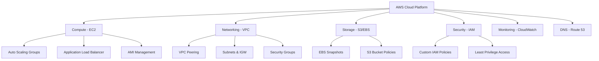

# 🚀 AWS DevOps Semester 4 - Advanced Infrastructure & Security Lab

> **Enterprise-Grade AWS Cloud Architecture & Security Implementation**  
> A comprehensive collection of hands-on AWS infrastructure exercises covering networking, compute, storage, security, and automation best practices.

[](https://aws.amazon.com/)
[](https://github.com)
[](https://aws.amazon.com/)

---

## 🎯 **Learning Objectives**

This repository demonstrates mastery of **critical AWS services** through practical implementations:

- 🔐 **Advanced Networking**: VPC, Subnets, Security Groups, Bastion Hosts
- ⚖️ **Load Balancing**: Application Load Balancer (ALB) with intelligent routing
- 📈 **Auto Scaling**: Dynamic EC2 fleet management with CloudWatch integration
- 🌐 **DNS Management**: Route 53 traffic routing and domain configuration
- 🔑 **Identity & Access**: Custom IAM policies with least privilege principles
- 🔗 **Cross-Account Networking**: VPC Peering for secure multi-account architecture
- 💾 **Storage Management**: S3, EBS Snapshots, and AMI lifecycle management

---

## 📋 **Tasks Portfolio**

### 🛡️ **Task 1: Private EC2 Access via Bastion Host**
**`Secure Infrastructure Gateway Pattern`**

| **Technology Stack** | **Implementation Focus** |
|---------------------|-------------------------|
| **VPC**, **Subnets**, **IGW** | Network segmentation & isolation |
| **Security Groups**, **NACLs** | Layer 4/7 firewall configuration |
| **SSH Key Management** | Secure remote access protocols |
| **Bastion Host Architecture** | Hardened jump server deployment |

**🔑 Key Concepts**: Network isolation, secure access patterns, defense-in-depth

---

### 📊 **Task 2: Auto Scaling Groups (ASG) Implementation**
**`Dynamic EC2 Fleet Management`**

| **Core Components** | **Advanced Features** |
|--------------------|----------------------|
| **AMI Templates** | Custom instance provisioning |
| **Launch Configurations** | Standardized deployment specs |
| **CloudWatch Alarms** | Metric-based scaling triggers |
| **Target Capacity Management** | Cost-optimized resource allocation |

**🔑 Key Concepts**: Horizontal scaling, CloudWatch integration, cost optimization

---

### ⚖️ **Task 3: Application Load Balancer Path-Based Routing**
**`Layer 7 Traffic Distribution`**

| **Routing Mechanisms** | **Backend Architecture** |
|------------------------|-------------------------|
| **Path-Based Rules** | `/app1/*` → Target Group 1 |
| **Health Checks** | Automated failure detection |
| **Target Groups** | Multi-instance load distribution |
| **Nginx Backend** | High-performance web serving |

**🔑 Key Concepts**: Layer 7 routing, microservices architecture, health monitoring

---

### 🌐 **Task 4: Route 53 DNS & Traffic Management**
**`Global DNS & Intelligent Routing`**

| **DNS Features** | **Traffic Policies** |
|------------------|---------------------|
| **Domain Configuration** | Authoritative DNS management |
| **Path-Based Routing** | URL pattern-based distribution |
| **Host Header Routing** | Multi-tenant application support |
| **Health Checks** | Failover & disaster recovery |

**🔑 Key Concepts**: DNS resolution, geographic routing, high availability

---

### 🔐 **Task 5: Custom IAM Policy Engineering**
**`Principle of Least Privilege Implementation`**

| **Policy Actions** | **Security Controls** |
|-------------------|----------------------|
| **✅ ec2:StartInstances** | Operational control granted |
| **✅ ec2:StopInstances** | Cost management capability |
| **✅ ec2:DescribeInstances** | Monitoring & visibility |
| **❌ ec2:TerminateInstances** | Destruction prevention |
| **🌍 us-west-1 Region Lock** | Geographic access restriction |

**🔑 Key Concepts**: IAM policy design, security boundaries, regional controls

---

### 🔗 **Task 6: Cross-Account VPC Peering**
**`Multi-Account Network Architecture`**

| **Architecture Components** | **Security Benefits** |
|----------------------------|----------------------|
| **Cross-Account Peering** | Private network connectivity |
| **Non-Overlapping CIDRs** | IP space management |
| **Route Table Configuration** | Traffic flow control |
| **Security Group Rules** | Granular access control |

**🔑 Key Concepts**: Multi-account strategy, network segmentation, cost optimization

---

### 💾 **Task 7: S3 Management via AWS CLI**
**`Object Storage & Public Access Configuration`**

| **CLI Operations** | **Security Configurations** |
|-------------------|----------------------------|
| **Bucket Creation** | `aws s3 mb` automation |
| **Object Upload** | `aws s3 cp` file transfers |
| **Public Access Policies** | JSON policy management |
| **HTTP URL Access** | Web-accessible content delivery |

**🔑 Key Concepts**: CLI automation, bucket policies vs ACLs, public access controls

---

### 🖥️ **Task 8: EBS Snapshots & AMI Management**
**`Enterprise Backup & Recovery Strategy`**

| **Backup Types** | **Use Cases** | **Recovery Time** |
|------------------|---------------|------------------|
| **EBS Snapshots** | Block-level storage backup | Fast (volume-specific) |
| **AMI Images** | Complete system replication | Moderate (full boot) |
| **Cross-Instance Data** | Platform-agnostic recovery | Variable |
| **Point-in-Time Recovery** | Data integrity assurance | Minimal downtime |

**🔑 Key Concepts**: Backup strategies, disaster recovery, cross-platform portability

---

## 🛠️ **Technology Stack**



---

## 📁 **Repository Structure**

```
📦 DEVOPS-SEM4-AWS-TASKS/
├── 📋 README.md                                    # This comprehensive guide
├── 🛡️ task 1 Private EC2 Access via Bastion/      # Network security implementation
├── 📈 task 2 Establish Auto Scaling using ASG/    # Dynamic scaling architecture
├── ⚖️ task 3 ALB Path Routing/                     # Load balancer configuration
├── 🌐 task 4 Route 53/                            # DNS & traffic management
├── 🔐 task 5 IAM Policy/                          # Security policy engineering
├── 🔗 task 6 VPC Peering/                         # Cross-account networking
├── 💾 task 7 Amazon S3 using AWS CLI/             # Object storage management
└── 🖥️ task 8 EBS Snapshot and AMI Demo/           # Backup & recovery systems
```

---

## 🚀 **Getting Started**

### **Prerequisites**
- ✅ **AWS Account** with administrative access
- ✅ **AWS CLI v2.x** configured with proper credentials
- ✅ **SSH Client** for EC2 instance access
- ✅ **Basic understanding** of networking concepts

### **Recommended Learning Path**
1. **Start with Task 1** → Foundational VPC networking
2. **Progress through Tasks 2-3** → Compute & load balancing
3. **Advance to Tasks 4-5** → DNS & security management
4. **Complete with Tasks 6-8** → Advanced architecture patterns

Each task folder contains **detailed documentation**, **implementation screenshots**, and **configuration examples**.

---

## 🎓 **Skills Demonstrated**

| **Domain** | **Advanced Capabilities** |
|------------|--------------------------|
| **🏗️ Architecture** | Multi-tier application design, microservices patterns |
| **🔐 Security** | Zero-trust networking, IAM policy engineering |
| **📈 Scalability** | Auto-scaling strategies, load balancing algorithms |
| **🔧 Automation** | Infrastructure as Code, CLI-driven deployments |
| **📊 Monitoring** | CloudWatch integration, health check automation |
| **💰 Cost Optimization** | Resource rightsizing, scaling policies |

---

## 📖 **Additional Resources**

- 📚 [AWS Well-Architected Framework](https://aws.amazon.com/architecture/well-architected/)
- 🔗 [AWS CLI Reference Documentation](https://docs.aws.amazon.com/cli/)
- 🛡️ [AWS Security Best Practices](https://aws.amazon.com/security/security-resources/)
- 📈 [CloudWatch Monitoring Guide](https://docs.aws.amazon.com/cloudwatch/)

---

