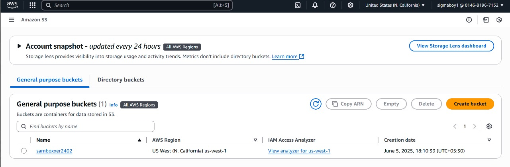

# Task-7 : Exploring AWS S3 via CLI — From Bucket Creation to Public Access

This repository documents my hands-on experience using the **AWS CLI** to interact with **Amazon S3**. The goal was to create a new S3 bucket, upload a file, configure public access, and retrieve the file via its public URL — all through the command line following **AWS best practices**.

---

## 🛠️ Tools & Technologies

| Technology | Version/Details |
|------------|----------------|
| **AWS CLI** | v2.x |
| **Git Bash** | Windows Terminal |
| **Amazon S3** | Simple Storage Service |
| **IAM** | Identity & Access Management |
| **JSON** | Bucket Policy Configuration |

---

## 🎯 Objectives

- ✅ **Bucket Creation** in specified AWS region
- ✅ **File Upload** using AWS CLI commands
- ✅ **Public Access Configuration** with proper permissions
- ✅ **HTTP URL Access** from web browser
- ✅ **Security Management**: ACLs vs Bucket Policies

---

## 📋 Implementation Steps

### 1. 🔧 **AWS CLI Configuration**
- **IAM User Setup** with programmatic access
- **Access Keys** configuration
- **Default Region** specification
- **Output Format** configuration


### 2. 🪣 **S3 Bucket Creation**
- **Unique Bucket Name** generation
- **Regional Deployment** selection
- **CLI Command Execution**
- **Bucket Verification**




### 3. 🔓 **Public Access Block Disable**
- **Default Security** modification
- **Public Access Settings** adjustment
- **Block Configuration** removal
- **Policy Preparation** for public access


### 4. 📤 **File Upload Operation**
- **Local File** selection
- **S3 PUT Command** execution
- **Object Key** specification
- **Upload Verification**


### 5. 📜 **Bucket Policy Configuration**
- **JSON Policy** creation
- **Principal Wildcard** (*) usage
- **GetObject Permission** grant
- **Resource ARN** specification
- **Policy Application**


### 6. 🌐 **Public URL Access**
- **HTTP Endpoint** construction
- **Browser Testing**
- **Public Accessibility** confirmation
- **URL Format**: `https://<bucket-name>.s3.<region>.amazonaws.com/<object-key>`


---

## 🔑 Key Technical Concepts

### **S3 Security Models**
- **Access Control Lists (ACLs)**: Object-level permissions
- **Bucket Policies**: Resource-based JSON policies
- **IAM Policies**: Identity-based permissions

### **CLI Commands Used**
```bash
aws s3 mb s3://bucket-name
aws s3 cp file.txt s3://bucket-name/
aws s3api put-bucket-policy --bucket bucket-name --policy file://policy.json
```

### **Bucket Policy Structure**
```json
{
    "Version": "2012-10-17",
    "Statement": [{
        "Sid": "PublicReadGetObject",
        "Effect": "Allow",
        "Principal": "*",
        "Action": "s3:GetObject",
        "Resource": "arn:aws:s3:::bucket-name/*"
    }]
}
```

---

## ⚠️ Security Considerations

- **Public Access**: Objects accessible to internet
- **Data Exposure**: Sensitive data risk
- **Best Practice**: Use signed URLs for temporary access
- **Monitoring**: CloudTrail for access logging
