# TASK-8: Exploring EC2, EBS Snapshots & AMIs on AWS

> **Advanced AWS Storage & Instance Management Demo**  
> Comprehensive exploration of **EBS Snapshots** and **Amazon Machine Images (AMIs)** for enterprise-grade data preservation and system replication.

---

## 🎯 **Objective**

Master critical AWS concepts:
- **EBS Snapshot Creation & Restoration** - Block-level storage backup
- **AMI Generation & Deployment** - Complete system image replication  
- **Storage vs System Backups** - Understanding granular vs holistic approaches
- **Cross-Instance Data Portability** - Seamless data migration strategies

---

## 🔧 **Technical Implementation**

### **Phase 1: Base Infrastructure Setup**
**Launch Primary EC2 Instance**
- Configure baseline AWS compute environment
- Establish foundational EBS volume attachment

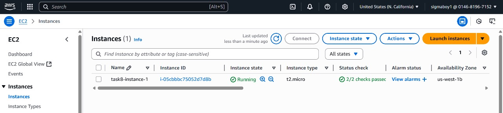
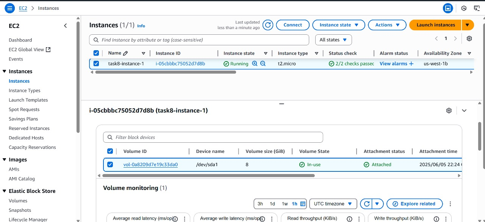

---

### **Phase 2: Data Injection & Preparation**
**SSH Connection & Data Population**
- Remote access establishment via SSH
- Custom data creation for backup validation

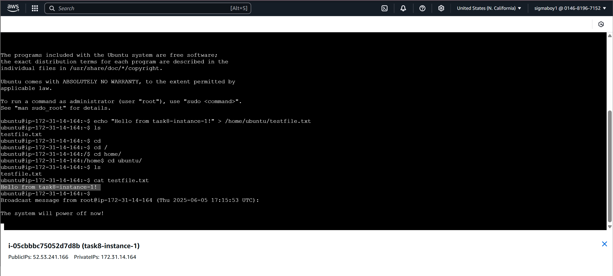

---

### **Phase 3: EBS Snapshot Operations**
**Block-Level Storage Backup**
- **Point-in-time snapshot creation**
- Volume-level data preservation
- **Incremental backup methodology**

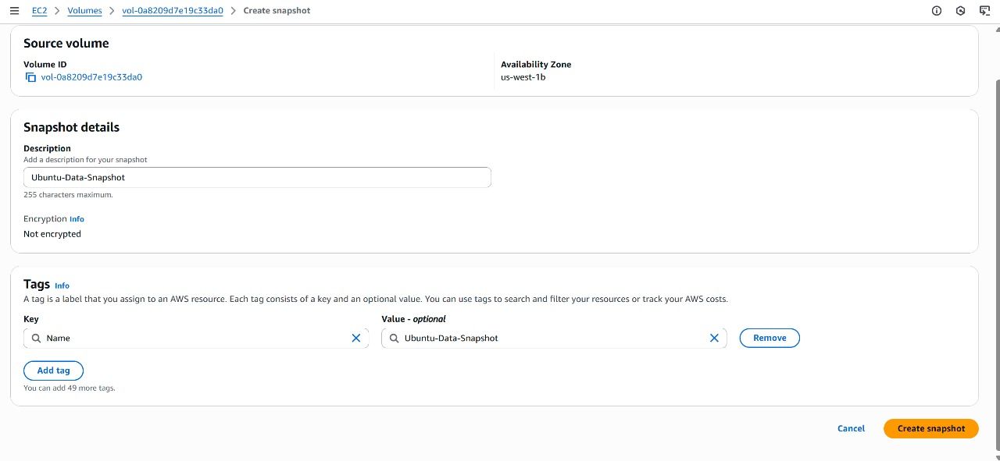

---

### **Phase 4: Volume Restoration Process**
**Snapshot-to-Volume Conversion**
- New EBS volume provisioning from snapshot
- **Data integrity verification**
- Cross-AZ volume deployment capability

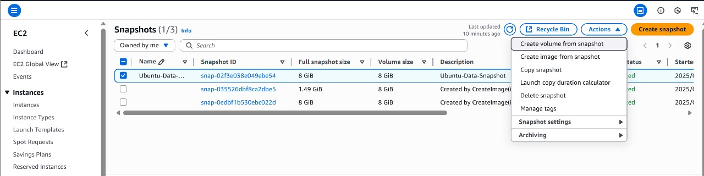
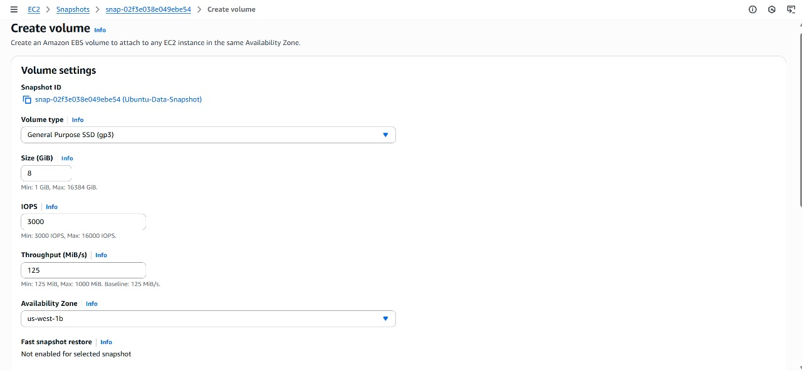

---

### **Phase 5: AMI Creation Workflow**
**System Image Generation**
- **Complete instance state capture**
- Boot volume + configuration preservation
- **Template creation for rapid deployment**

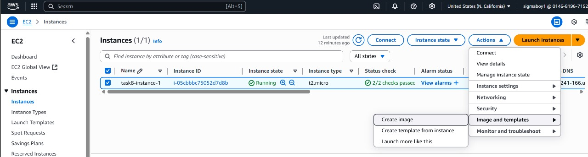

---

### **Phase 6: Cross-Platform Testing**
**RHEL Instance Deployment**
- Launch secondary EC2 instance (Red Hat Enterprise Linux)
- **Operating system diversity testing**

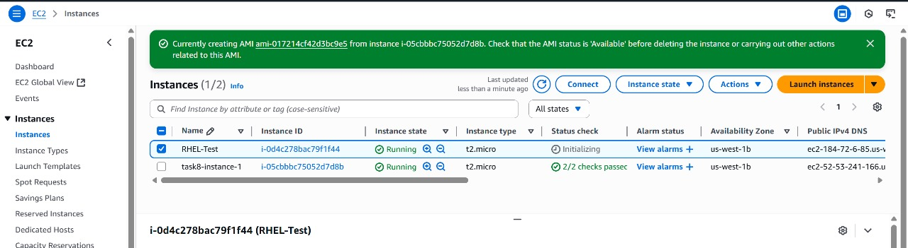

---

### **Phase 7: Volume Attachment & Integration**
**Snapshot Data Recovery**
- EBS volume attachment to new instance
- **File system mounting procedures**
- **Cross-instance data accessibility**

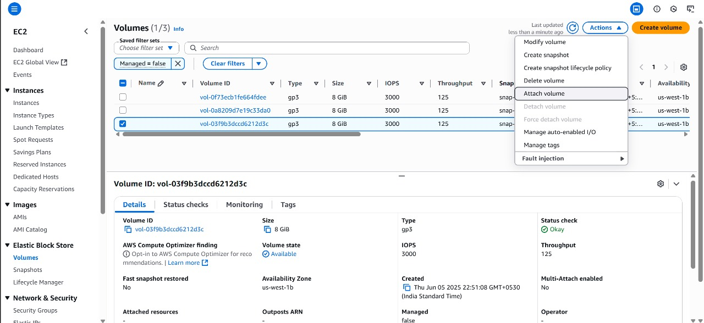
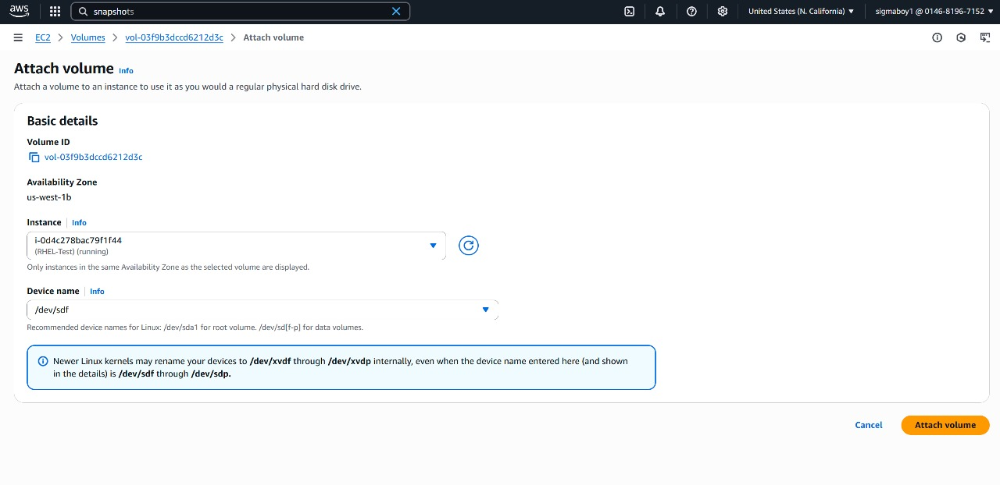

---

### **Phase 8: Data Validation & Verification**
**Snapshot Integrity Testing**
```bash
# Expected Output: Hello from task8-instance-1!
```
- **Terminal-based data verification**
- **Successful cross-instance data recovery**

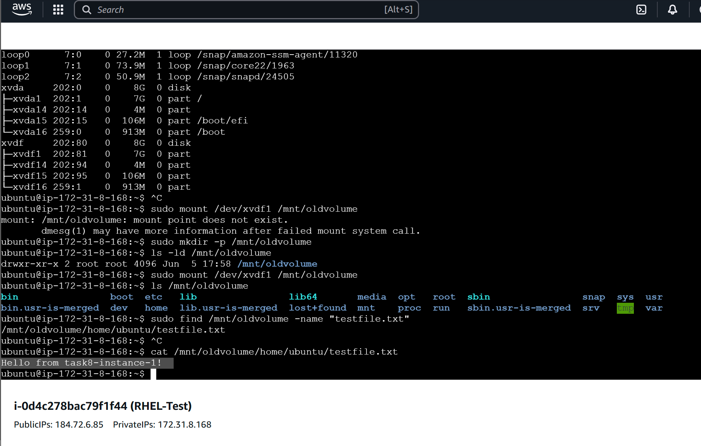

---

## 🚀 **AMI Portability Validation**

### **Phase 9: AMI-Based Instance Launch**
**Template Deployment**
- **One-click instance replication**
- Complete system state restoration
- **Configuration inheritance verification**

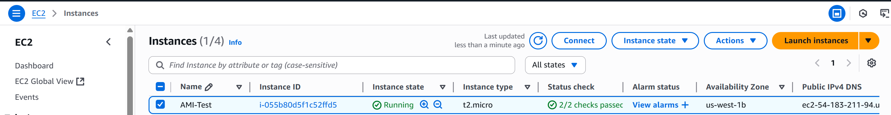

---

### **Phase 10: AMI Instance Verification**
**System Integrity Confirmation**
- **Application state preservation**
- **Environment consistency validation**
- **End-to-end replication success**

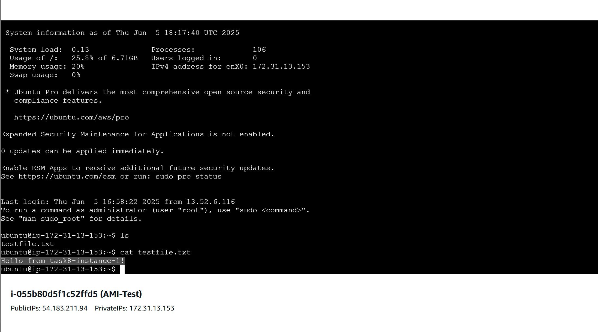

---

## 📊 **Key Technical Differentiators**

| **Backup Type** | **Scope** | **Use Case** | **Recovery Time** |
|-----------------|-----------|--------------|-------------------|
| **EBS Snapshot** | Block-level storage | Data recovery, volume cloning | Fast (volume-specific) |
| **AMI** | Complete system image | Full instance replication | Moderate (full boot cycle) |

---

## ✅ **Validation Criteria**
- [ ] **Snapshot data accessibility** across different instances
- [ ] **AMI-based instance** functional equivalency  
- [ ] **Cross-platform compatibility** (Ubuntu → RHEL)
- [ ] **Data integrity preservation** throughout backup/restore cycle